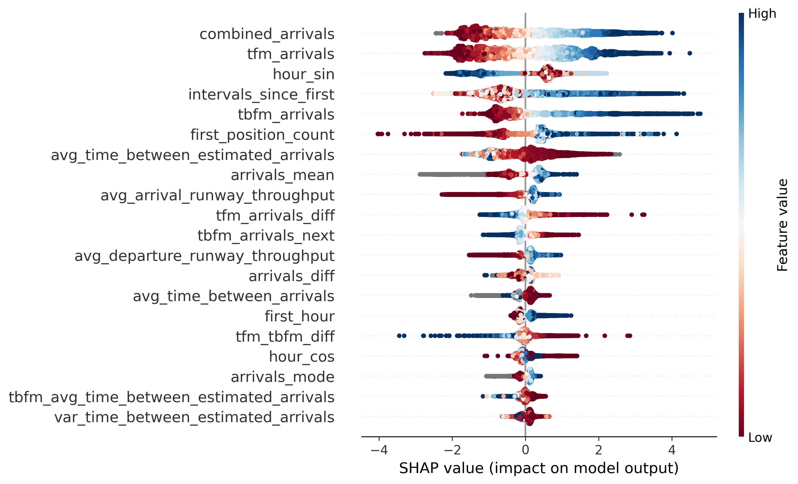

# Solution - NASA Airport Throughput Prediction Challenge

Third place respository for forcasting throughput at US airports.  

[Competition website &rarr;](https://bitgrit.net/competition/23)

## Overview
This repository contains code to create and execute a model to predict airport throughput (defined as the number of arrivals for a given 15 minute interval) as specified by the 2024 NASA Throughput Prediction Challenge. Given the provided data from ten US airports, a CatBoost model is trained separately on each airport following data normalization and feature extraction. About 40 features were extracted from the following raw datasets:
- "tfm_track", "runways", "lamp", "tbfm", "etd", "first_position", "mfs", "configs"

The config.py file contains the hyperparameters for each Catboost model. For more details regarding the extracted features, please refer to the comments in the make_dataset.py file.

## Preventing Data Leakage
The following safeguards were implemented to ensure that no future data was being used to make predictions.
- The find_csv_files function in utils.py filters out any files with a date range in its name.
- The filter_labels_split function in utils.py ensures that a dataframe contains only data from the specified split
    (Training or Testing) based on the cyclical 24-day Training / 8-day Testing pattern and rows not belonging to the specified split are removed.
- When extracting features from a dataset, rows are filtered to only include data within the first hour of each 4 hour group and dataframes are merged on matching 4 hour groups to ensure that features are computed within each 4 hour prediction interval.


## Repository Structure
This repository contains separate pipelines for model training and inference. Trained models are stored in the "models" folder.

```
nasa-throughput-challenge
├── README.md
├── requirements.txt ------> lists requirements
├── model -----------------> holds trained model
├── predictions -----------> holds model predictions
├── data ------------------> raw FUSER train data
│   ├── KATL
│   ├── ...
│   └── test_data ---------> raw FUSER test data
│       ├── KATL
│       └── ...
└── src
    ├── __init__.py
    ├── config.py ---------> path configuration
    ├── make_dataset.py ---> extract and cache dataset features
    ├── run_inference.py --> pipeline for making predictions
    ├── run_training.py ---> pipeline for training model
    └── utils.py ----------> helper functions used for inference
```

## Setup
```
python3 -m venv venv
source venv/bin/activate
pip install -r requirements.txt
```

- Unzip each FUSER_train_{airport}.zip file into the corresponding data/{airport} folder.
- Unzip the FUSER_test.zip file into the data/test_data folder.
- Optionally, update the config.py file with your root_directory path.

## Hardware

e2-highmem-8 VM machine instance from Google Cloud

* CPU: 8 vCPU
* GPU: N/A
* Memory: 64 GB
* OS: Ubuntu
* Train duration: 1 hour
* Inference duration: 10 minutes on the full dataset


## Run training

Execute feature extraction and model training pipeline:
```
python src/make_dataset.py
python src/run_training.py
```

## Run inference

Generate predictions in submission format:
```
python src/run_inference.py
```

## Results

The model achieved a RMSE of 1.813 on the private validation dataset and scored 3rd in the competition. A chart of the model's feature importances (SHAP values) for the KATL airport is shown below.

<center></center>
